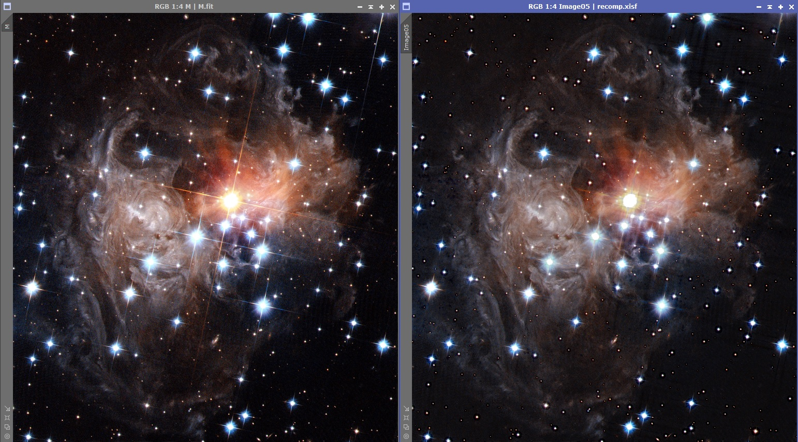

# Diffraction Spike Removal
Use Radon transform to remove diffraction spikes in a telescope image

For a full discussion, visit : https://erellaz.com/diffraction-spike-attenuation/ 

<!-- wp:paragraph -->

The linear Radon transform is a well established integral transform which maps the space (x, y) domain into a new domain, the radon domain (tau, p). See Wikipedia: Radon transform, Hough transform, Sonogram, Tau p transform. The Radon transform collapses (focuses) linear events into points. After Radon transform:

<!-- /wp:paragraph -->

<!-- wp:list -->
<ul><li>The linear events (diffraction patterns) and the signal are disjoint (map in different areas of the Radon plane)</li><li>The linear events (diffraction patterns) are collapsed (concentrated in a small area of the Radon plane). So now the diffraction can be muted (masked) without damaging the data.</li></ul>
<!-- /wp:list -->

<!-- wp:paragraph -->

The code attached is written in python 2. I will futurize to python 3 at some point. The module astropy.io handles fits format (works on both mono and RGB) for input and output. Skimage is used for the radon and inverse radon transform.

<!-- /wp:paragraph -->

<!-- wp:paragraph -->

There is quite a bit happening under the hood. The data is split in overlapping window, each processed independently. This is a classical signal processing technique.

<!-- /wp:paragraph -->

<!-- wp:paragraph -->

Bottom line: it works, as shown in the example attached. The diffraction is attenuated or even completely removed. The underlying data is revealed.

<!-- /wp:paragraph -->
